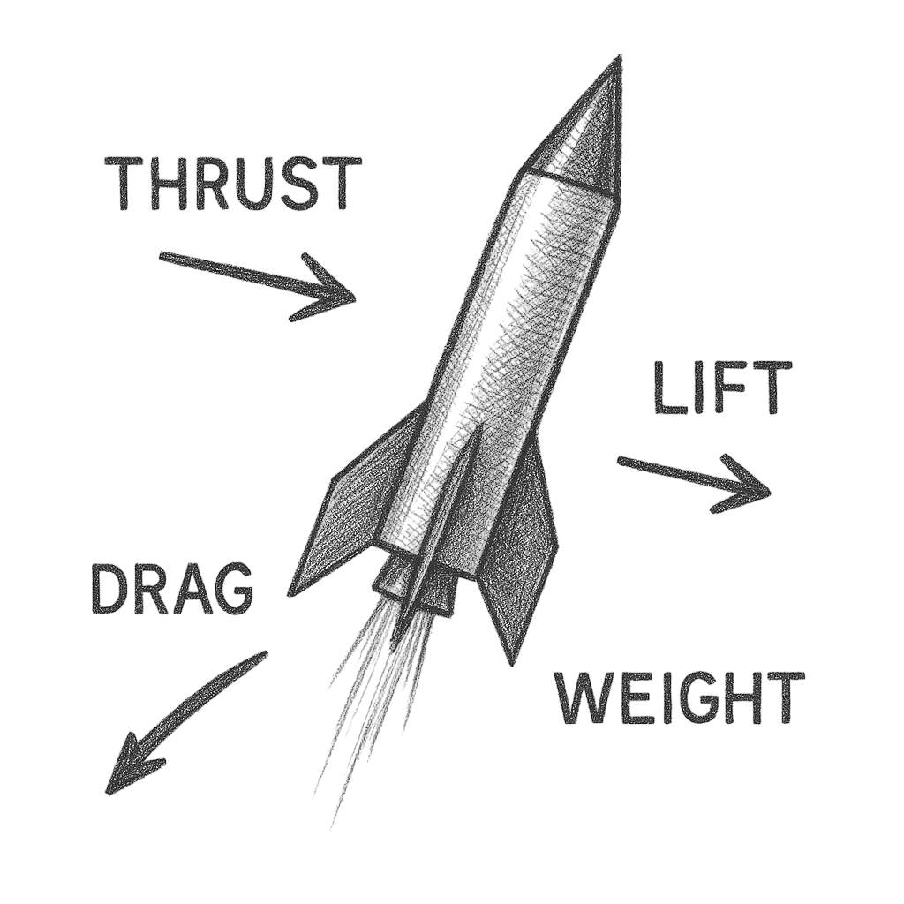
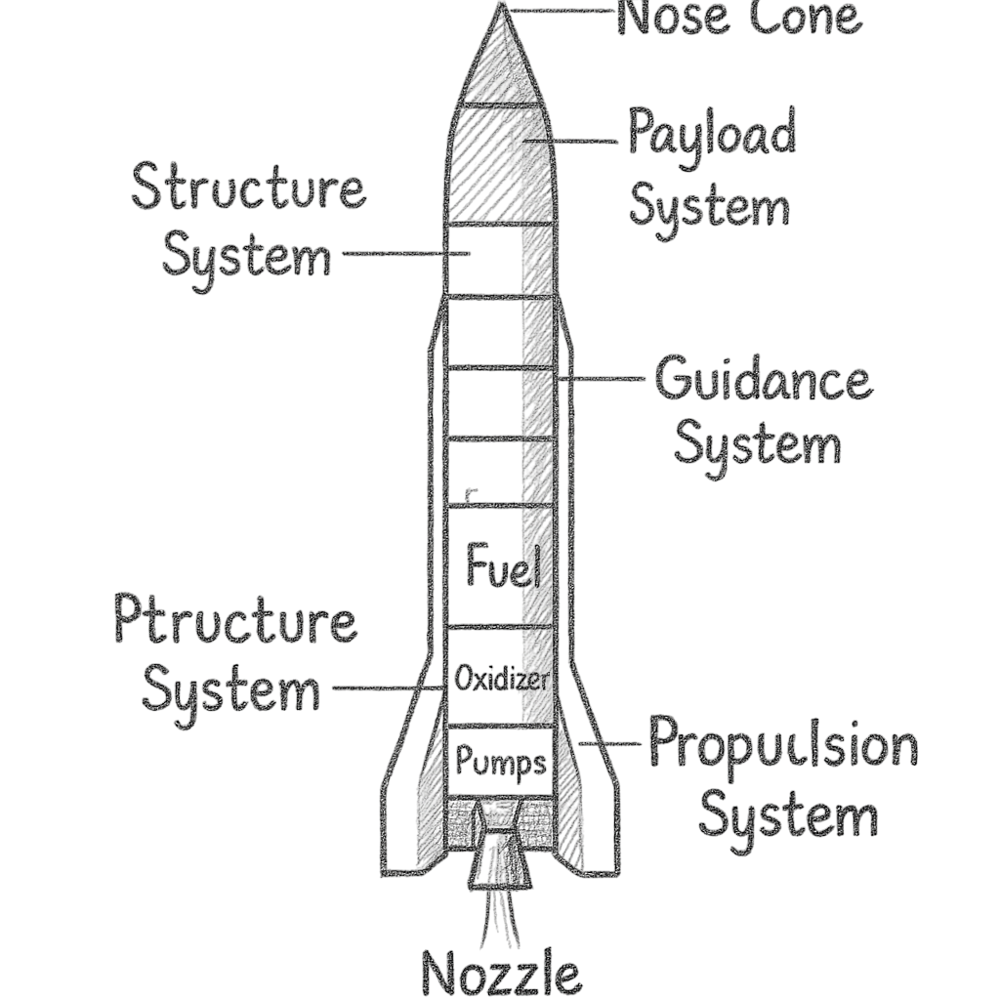

# Guía Básica de Cohetes (NASA)

> **NOTE** Basado en la "Beginner's Guide to Rockets" de la NASA: [https://www1.grc.nasa.gov/beginners-guide-to-aeronautics/guide-to-rockets/](https://www1.grc.nasa.gov/beginners-guide-to-aeronautics/guide-to-rockets/)

<figure><figcaption></figcaption></figure>

### Fundamentos de los Cohetes

* **Peso:** Depende de la masa de todas las partes del cohete. La fuerza del peso siempre se dirige hacia el centro de la Tierra y actúa a través del centro de gravedad (punto amarillo en la figura).
* **Empuje:** Depende del caudal másico que pasa por el motor y de la velocidad y la presión a la salida de la tobera. La fuerza de empuje normalmente actúa a lo largo del eje longitudinal del cohete y pasa por el centro de gravedad.
* **Fuerzas Aerodinámicas:** Su magnitud depende de la forma, el tamaño y la velocidad del cohete, así como de las propiedades de la atmósfera. Estas fuerzas actúan a través del centro de presión (punto negro y amarillo en la figura).
* **Sustentación y Resistencia:** Algunos cohetes a escala real pueden mover sus toberas (cardan) para generar una fuerza que no está alineada con el centro de gravedad. El par resultante permite maniobrar el cohete.

> **IMPORTANT** **Motor de Cohete:** En un motor cohete, el combustible y el oxidante almacenados se encienden en una cámara de combustión. La combustión produce gases de escape a alta temperatura y presión. Estos gases pasan por una tobera que acelera el flujo, generando empuje según la tercera ley de Newton: “A toda acción le corresponde una reacción de igual magnitud y en sentido opuesto”.&#x20;

> **NOTE** **Peso de un Cohete:** El peso es la fuerza generada por la atracción gravitatoria sobre el cohete. Es una de las fuerzas más familiares, aunque su naturaleza es distinta a las fuerzas aerodinámicas o el empuje.

***

### Partes de un Cohete

> **NOTE** Basado en: [https://www1.grc.nasa.gov/beginners-guide-to-aeronautics/rocket-parts/](https://www1.grc.nasa.gov/beginners-guide-to-aeronautics/rocket-parts/)

<figure><figcaption></figcaption></figure>

> **INFO** **Sistema Estructural:**
>
> * El sistema estructural (o armazón) es similar al fuselaje de un avión. Fabricado con materiales resistentes y ligeros como titanio o aluminio, emplea largueros longitudinales y aros transversales.
> * La piel del cohete se adhiere al armazón y puede incluir protección térmica para soportar el calor de la fricción del aire y conservar bajas temperaturas requeridas por ciertos combustibles. Algunas estructuras incluyen aletas para mejorar la estabilidad en vuelo.

> **INFO** **Sistema de Carga Útil:**
>
> * Depende de la misión del cohete. Inicialmente, muchos cohetes fueron diseñados para transportar ojivas nucleares.
> * Posteriormente se adaptaron para lanzar satélites con misiones como:
>   * Comunicaciones
>   * Monitoreo meteorológico
>   * Espionaje
>   * Exploración planetaria y observatorios (ej. Telescopio Espacial Hubble)
>   * Transporte de humanos a órbita o a la Luna

> **INFO** **Sistema de Propulsión:**
>
> * La mayor parte de un cohete está dedicada al sistema de propulsión.
> * **Existen dos tipos principales:**
>   * Motores de propulsión líquida: incluyen tanques de combustible y oxidante (propelente), bombas, cámara de combustión con tobera y tuberías.
>   * Motores de propulsión sólida: utilizados en el transbordador espacial, Delta II y Titan III.

***

### Redes sociales

* LinkedIn: [https://www.linkedin.com/in/tuch0/](https://www.linkedin.com/in/tuch0/)
* Instagram: [https://www.instagram.com/tuch0\_/](https://www.instagram.com/tuch0_/)
* YouTube: [https://www.youtube.com/@tuch0](https://www.youtube.com/@tuch0)\_
* GitHub: [https://github.com/Tuch0](https://github.com/Tuch0)
* Web personal: [https://tuch0.com/](https://tuch0.com/)
