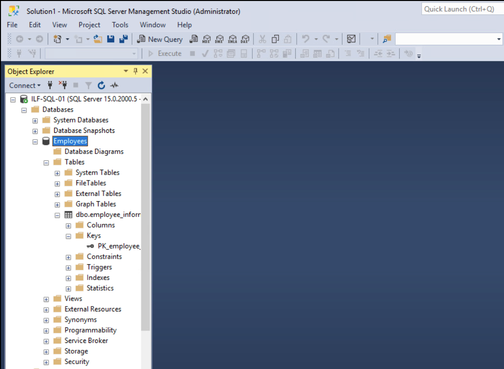

# 1433 (MSSQL)

## MSSQL

> **NOTE** **Microsoft SQL Server (MSSQL)** es el sistema de gestión de bases de datos relacionales de Microsoft basado en SQL. A diferencia de MySQL, que se analizó en la sección anterior, MSSQL es de código cerrado y fue diseñado inicialmente para ejecutarse en sistemas operativos Windows.

***

### Clientes MSSQL

> **NOTE** **SQL Server Management Studio (SSMS)** se ofrece como una función instalable junto con el paquete de MSSQL o de forma independiente. Comúnmente se instala en el servidor para la configuración inicial y la gestión a largo plazo por parte de administradores.

<figure><figcaption></figcaption></figure>

#### Clientes comunes para acceder a MSSQL

* [mssql-cli](https://learn.microsoft.com/en-us/sql/tools/mssql-cli?view=sql-server-ver15)
* [PowerShell de SQL Server](https://learn.microsoft.com/en-us/powershell/sql-server/sql-server-powershell?view=sqlserver-ps\&viewFallbackFrom=sql-server-ver15)
* [HeidiSQL](https://www.heidisql.com/)
* [SQLPro](https://www.macsqlclient.com/)
* [mssqlclient.py de Impacket](https://github.com/fortra/impacket/blob/master/examples/mssqlclient.py)

***

### Bases de datos predeterminadas en MSSQL

> **NOTE** MSSQL incluye bases de datos de sistema que permiten entender la estructura y configuración de un servidor objetivo. Estas son las principales:

| Base de datos del sistema | Descripción                                                                         |
| ------------------------- | ----------------------------------------------------------------------------------- |
| `master`                  | Guarda información del sistema para una instancia de SQL Server.                    |
| `model`                   | Base de datos plantilla. Su configuración se hereda al crear nuevas bases de datos. |
| `msdb`                    | Utilizada por el Agente SQL Server para tareas programadas y alertas.               |
| `tempdb`                  | Almacena objetos temporales.                                                        |
| `resource`                | Solo lectura. Contiene objetos del sistema del servidor SQL.                        |

***

### Configuración predeterminada

> **IMPORTANT** Al instalar MSSQL, es común que el servicio se ejecute como `NT SERVICE\MSSQLSERVER`, lo que puede influir en los permisos y en la exposición del servicio.

***

### Configuraciones peligrosas comunes

> **TIP** Adoptar la perspectiva de un administrador de TI puede ayudarte a detectar configuraciones incorrectas o peligrosas durante una auditoría.

* [ ] Clientes MSSQL sin cifrado en las conexiones.
* [ ] Uso de certificados autofirmados, susceptibles de falsificación.
* [ ] Uso de "Named Pipes": [https://learn.microsoft.com/en-us/sql/tools/configuration-manager/named-pipes-properties?view=sql-server-ver15](https://learn.microsoft.com/en-us/sql/tools/configuration-manager/named-pipes-properties?view=sql-server-ver15)
* [ ] Credenciales por defecto o débiles para la cuenta `sa`.

***

### Enumeración de MSSQL

```bash
# Enumerar nombre del host, instancia, versión, Named Pipes, etc. usando Nmap
sudo nmap --script ms-sql-info,ms-sql-empty-password,ms-sql-xp-cmdshell,ms-sql-config,ms-sql-ntlm-info,ms-sql-tables,ms-sql-hasdbaccess,ms-sql-dac,ms-sql-dump-hashes \
--script-args mssql.instance-port=1433,mssql.username=sa,mssql.password=,mssql.instance-name=MSSQLSERVER \
-sV -p 1433 10.129.201.248

# Conexión con mssqlclient.py (Impacket)
python3 mssqlclient.py Administrator@10.129.201.248 -windows-auth
```

> **NOTE** Puedes complementar la enumeración con los módulos auxiliares de Metasploit: [Metasploit MSSQL Modules](https://www.offsec.com/metasploit-unleashed/scanner-mssql-auxiliary-modules/)

***

### Redes sociales

* LinkedIn: [https://www.linkedin.com/in/tuch0/](https://www.linkedin.com/in/tuch0/)
* Instagram: [https://www.instagram.com/tuch0\_/](https://www.instagram.com/tuch0_/)
* YouTube: [https://www.youtube.com/@tuch0](https://www.youtube.com/@tuch0)\_
* GitHub: [https://github.com/Tuch0](https://github.com/Tuch0)
* Web personal: [https://tuch0.com/](https://tuch0.com/)

> 📄 Apuntes personales de HTB Academy. Para uso educativo.
